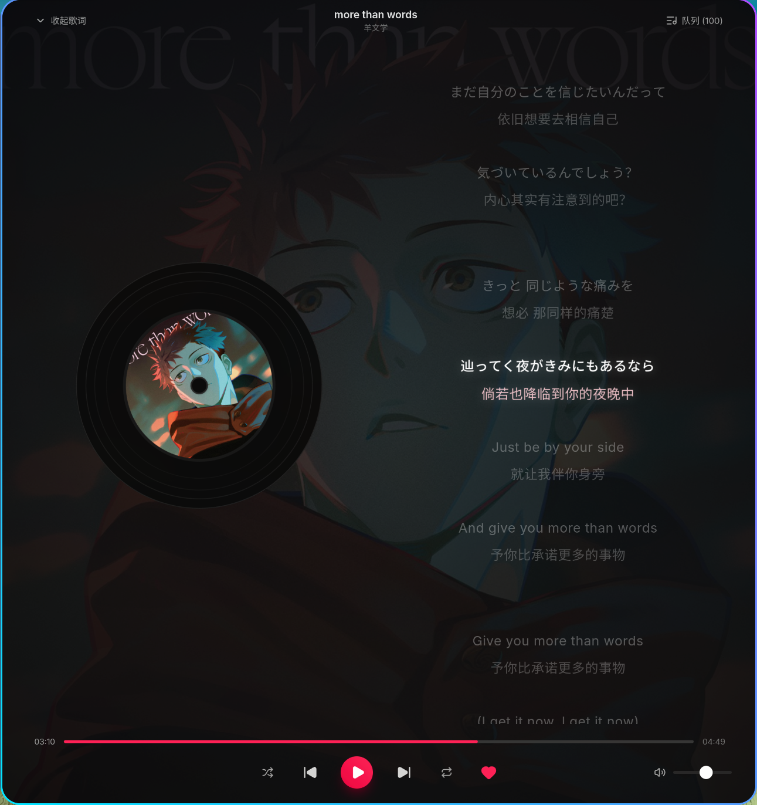
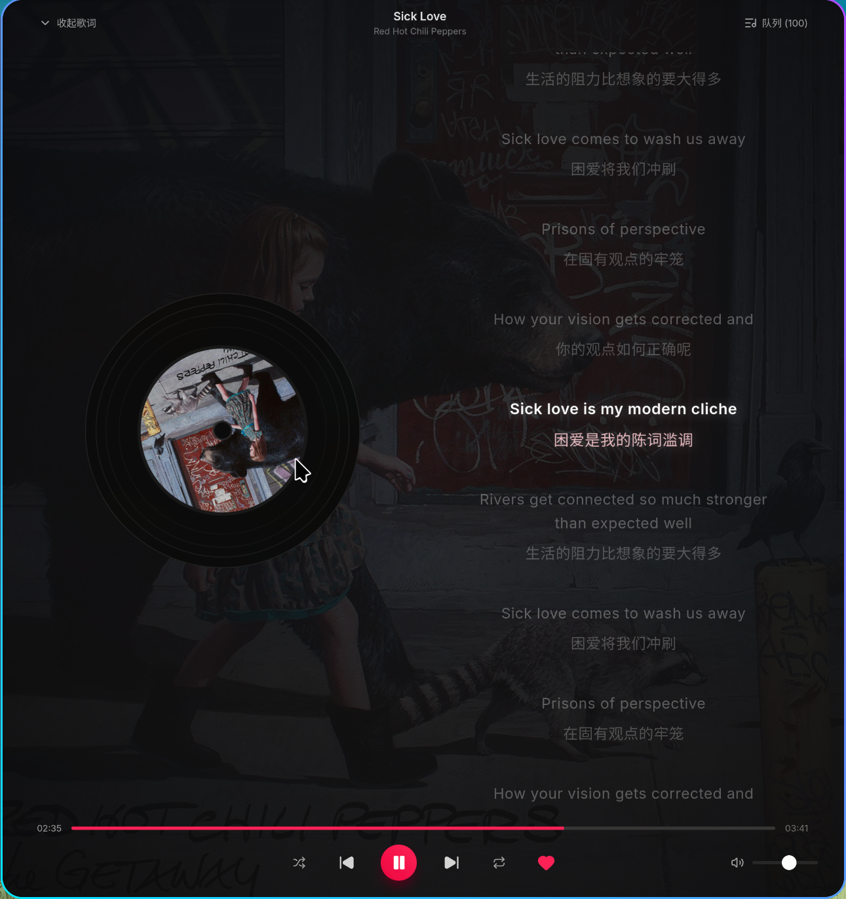

<div align="center">

# AkaEase

### A Fast, Modern & Native Linux Music Experience

[](LICENSE)
[-neutral.svg)]()
[](https://tauri.app/)
[](https://gstreamer.freedesktop.org/)
[]()

专为 Linux 桌面平台打造的原生音乐播放客户端。  
基于 **Tauri 2 + Rust + React 19** 构建，深度融合 **GStreamer** 高性能音频引擎与系统级 **MPRIS** 媒体控制。

[📸 界面预览](#-界面预览) • [✨ 特性亮点](#-特性亮点) • [🏗️ 架构与性能](#️-架构与性能) • [🚀 快速开始](#-快速开始) • [⚖️ 免责声明](#️-免责与合规声明-disclaimer)

<br/>

<a href="#-界面预览">
  
</a>

<p align="center">
  <sub>▲ 沉浸式黑胶唱机动效与 Apple Music 风格双语同步歌词实机效果</sub>
</p>

---

</div>

## 📸 界面预览

<div align="center">

| 沉浸式黑胶歌词舞台 · J-Pop 氛围 | 沉浸式黑胶歌词舞台 · 欧美摇滚氛围 |
| :---: | :---: |
|  |  |
| **《more than words》· 羊文学**<br><sub>双语实时同步 · 焦点高光渐隐 · 动态氛围晕染</sub> | **《Sick Love》· Red Hot Chili Peppers**<br><sub>高保真金属黑胶 · 物理惯性停驻 · 毫秒级 Seek</sub> |

</div>

---

## ✨ 特性亮点

- 🎨 **极简深空沉浸舞台**：
  - 采用无边框全沉浸式窗口（Borderless & Frameless），原生支持窗口任意空白区域随心拖拽；
  - 动态电影级专辑艺术色彩晕染（Cinematic Vignette），环境氛围感纯净通透，根据唱片色调自适应流体背景。
- 💿 **高保真黑胶唱机动效**：
  - 拟物化同心金属沟槽黑胶转盘，支持 24s 匀速旋转与自然物理停驻动效（Pause-state Preservation），暂停不跳步。
- 📜 **Apple Music 风格双语同步歌词**：
  - 原文与中文翻译同字号黄金排版，消除断行跳动（Zero Layout Shift）；
  - 300ms 丝滑 Crossfade 焦点高光跟随，毫秒级精度滚动，支持点击任意单行即时定位播放（Instant Seek）。
- ⚡ **150fps+ 极高刷新率流体滚动**：
  - 为 144Hz / 165Hz / 240Hz+ 电竞与高刷显示器量身定制的硬件加速合成层（Compositing Layer Isolation）；
  - 视口外虚拟剪裁与现代 `content-visibility` 优化，数百首长歌单流畅滚装不掉帧。
- 🐧 **Linux 原生系统级深度整合**：
  - 基于 **GStreamer 1.0** 底层流媒体管线，原生硬件解压、超低音频延迟与无缝缓冲；
  - 完整实现 Linux **MPRIS D-Bus** 规范，原生响应多媒体键盘快捷键、锁屏媒体控件、GNOME/KDE 系统托盘集成。
- 🎛️ **全功能播放中枢与音乐库探索**：
  - 官方精选榜单、每日推荐、雷达歌单随心畅听；
  - 沉浸式专辑/歌手详情大图、歌曲列表抽屉（Queue Drawer）、随机与循环模式自如切换；
  - 原生支持二维码安全扫码登录与个人喜欢歌单秒级双向同步。

---

## 🏗️ 架构与性能

```text
┌────────────────────────────────────────────────────────┐
│                   AkaEase Frontend                     │
│         React 19 • TypeScript • Tailwind CSS           │
│  (Hardware-Accelerated Compositing Layer • 150fps+)    │
└──────────────────────────┬─────────────────────────────┘
                           │ Tauri 2 IPC (Strongly Typed)
┌──────────────────────────┴─────────────────────────────┐
│                   AkaEase Desktop Host                 │
│                 Rust • Tokio Async Engine              │
├──────────────────────────┬─────────────────────────────┤
│   Audio Engine Pipeline  │    Linux System Bridge      │
│     (GStreamer 1.0)      │   (MPRIS D-Bus & Secret)    │
└──────────────────────────┴─────────────────────────────┘
```

---

## 🚀 快速开始

### 运行环境依赖

确保系统已安装基础桌面运行时库：

#### Arch Linux / Manjaro
```bash
sudo pacman -S gstreamer gst-plugins-base gst-plugins-good webkit2gtk-4.1
```

#### Ubuntu / Debian (22.04+)
```bash
sudo apt install libgstreamer1.0-0 gstreamer1.0-plugins-base gstreamer1.0-plugins-good libwebkit2gtk-4.1-0
```

### 构建与打包

```bash
# 1. 克隆公开仓库
git clone https://github.com/heathacosta259519-dot/AkaEase.git
cd AkaEase

# 2. 一键编译前端生产产物并打包桌面程序
./build.sh
```

构建脚本将自动完成 TypeScript 编译、Rust 发布版本构建及完整的隔离环境健康自检，最终绿色打包产物位于 `dist/` 目录下。

### 常用操作与交互

| 功能 | 操作方式 |
| :--- | :--- |
| **全屏歌词展开 / 收起** | 点击播放栏左侧黑胶封面 / 点击左上角「收起歌词」 |
| **歌词点击即跳 (Seek)** | 直接点击歌词视图中任意单行文本 |
| **播放队列抽屉** | 点击播放控制区右上角「队列 (Queue)」按钮 |
| **系统级媒体控制** | 键盘多媒体按键 / MPRIS 桌面小部件直接控制播放、暂停、上一曲、下一曲 |

---

## ⚖️ 免责与合规声明 (Disclaimer)

请在阅读并理解以下条款后使用本软件：

1. **项目性质**：
   - 本项目（`AkaEase`）是一个基于开源技术（Tauri 2、GStreamer、React）开发的**独立、非官方桌面播放器前端实现**。
   - 本项目仅供个人学习、技术研究与 Linux 桌面媒体栈交流使用，**不代表任何商业机构或流媒体平台官方立场，亦未获得任何第三方的官方赞助或背书**。
2. **版权归属与数据安全**：
   - 本软件不托管、不存储、不提供任何音频流媒体文件及唱片元数据。所有展示的曲目信息、音频资源、歌词文本与封面画作之知识产权均归其**各自的原始版权方或合法权利人所有**；
   - 本软件严格遵循标准流媒体服务访问规范，**不具备、不提供、亦绝不支持任何破除付费限制、下载盗版、抓取加密音频流或绕过 DRM / 权限管控之功能**；
   - 用户使用本客户端登录或访问第三方账户时，所产生的数据传输均直接与对应服务节点交互，本项目不收集任何个人凭据、密码或隐私数据。
3. **商标合规**：
   - 本项目中出现的任何第三方商标、服务标志或产品名称仅用于事实性技术适配与客观兼容性说明，其所有权均归其合法所有者所有。
4. **服务条款遵守**：
   - 使用者应当自行遵守所在国家/地区之法律法规以及相关流媒体平台的服务协议与使用条款。请支持正版音乐。

---

## 📄 License

本项目采用 [MIT License](LICENSE) 授权开源。
